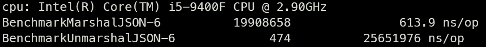
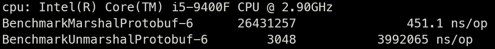

> # **Comparison between Protocol Buffer & JSON**

Sample project to compare Protocol Buffer versus JSON.

* [Protocol Buffer](https://developers.google.com/protocol-buffers)
* [JSON](https://www.json.org/json-en.html)
---

## Configure environment variable

To run the project you need to install the **GNU Make**, **protobuffer compiler** and **go code generator**.

* [Protobuffer compiler](https://developers.google.com/protocol-buffers/docs/downloads)
* Go code generator
  * `go install google.golang.org/protobuf/cmd/protoc-gen-go`
* [GNU Make](https://www.gnu.org/software/make/)
    * The way to install will depend on your system environment
* [Docker](https://www.docker.com/products/docker-desktop)
* [Docker Compose](https://docs.docker.com/compose/install)
* Redis Client
  * You can install any _Redis Client_ for your system to login and show all saved values
---

## Commands
* `make help`
  * Show all make commands
  
* `make compile-protoc-win`
  * For that, you need to have `$PROTOC` name as an environment variable to **protoc**    
  * Generates go code from proto file to Windows

* `make compile-protoc-macos`
    * Generates go code from proto file to MacOS

* `make run-proto`
  * Run _Protocol Buffer_ project and insert data on cache

* `make run-json`
  * Run _JSON_ project and insert data on cache
  
* `make docker-build-up`
  * Build and start all containers

* `make docker-up`
  * Start all containers

* `make docker-down`
  * Stop all containers

* `make docker-ps`
  * Show all containers running

* `make proto-bench`
  * Run all benchmark tests to protocol buffer format

* `make json-bench`
  * Run all benchmark tests to json format
---

## Results
Presenting the results of running benchmark tests to compare _Marshal_ and _Unmarshal_ using _Protocol Buffer_ and _JSON_, as well as _Redis memory usage_ with 10,000 inserted items 

Tips:
* Each test ran for 10 seconds
* The first column is the number of iterations run, this is a fairly light process, so it completes quickly, and many iterations can be run
* `ns/op` column - this is the average time each function call takes to complete
###### JSON

```shell
# Redis
used_memory: 2965888
```
###### PROTOCOL BUFFER
> **Marshal:** ≅26% more performative

> **Unmarshal:** ≅85% more performative


```shell
# Redis (≅25% less memory used)
used_memory: 2225616
```